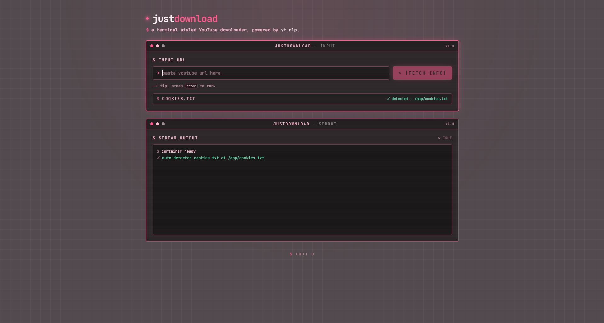

# justdownload

A terminal YouTube downloader. `yt-dlp` + `ffmpeg`, no GUI, no Electron, no Docker. Single Python script, ~150 lines for the CLI.



## Run it

```bash
pip install -e .
justdownload "https://www.youtube.com/watch?v=..."
```

Or with a specific format (skip the picker):

```bash
justdownload "https://..." --format 22
```

## What it looks like

```
$ justdownload "https://www.youtube.com/watch?v=abc"
justdownload · terminal YouTube downloader

  cookies:  /home/xw05/justdownload/cookies.txt
  output:   /home/xw05/Downloads/justdownload

[fetching info...]
  Title:    Rick Astley - Never Gonna Give You Up
  Channel:  Rick Astley
  Duration: 3:33  ·  uploaded 2009-10-25
  Formats:  27

Formats:
  [0] ★ Best Quality (Auto)
  [1] [m4a] audio only (Audio Only) - low  ~ 1.2MiB
  [2] [mp4] 1920x1080 (Video Only) - 1080p - 25fps  ~ 77.2MiB
  ...

  Pick a format [0-27, default 0]: 0
  → format best

$ yt-dlp --no-playlist --newline --progress --no-colors --restrict-filenames ...
[youtube] Extracting URL: ...
[download] Destination: /home/xw05/Downloads/justdownload/Rick_Astley.mp4
[download]   0.0% of  229.2MiB at  2.1MiB/s ETA 01:48
[download] 100.0% of 229.2MiB in 01:52

  ✓ saved to: /home/xw05/Downloads/justdownload/Rick_Astley.mp4
```

Non-interactive (piped, scripted):

```bash
echo "" | justdownload "https://..."            # defaults to "best"
justdownload "https://..." --format 22          # explicit, no picker
```

## Commands

| Command | What it does |
|---|---|
| `justdownload URL` | Fetch info, pick a format, download |
| `justdownload URL -f 22` | Download with a specific format, no picker |
| `justdownload -o /path URL` | Download to a specific directory (saves as default) |
| `justdownload --status` | Show yt-dlp / ffmpeg versions + config |
| `justdownload --update` | Check + offer to update yt-dlp |
| `justdownload --update -y` | Update yt-dlp without prompting |

## Prereqs

- **Python 3.10+**
- **yt-dlp** (`pip install yt-dlp`)
- **ffmpeg** for best-quality merges (`apt install ffmpeg` / `brew install ffmpeg`)

## Cookies (optional)

For age-restricted, members-only, or private videos, drop a Netscape-format `cookies.txt` next to the project or in `~/justdownload/`. Export from your browser via the "Get cookies.txt LOCALLY" extension. The CLI auto-detects it and passes it to yt-dlp.

## Output

Default: `~/Downloads/justdownload/`. Override with `-o`. The first `-o` value gets saved as the new default in `~/.config/justdownload/settings.json`.

## Updating yt-dlp

YouTube breaks things often. `yt-dlp` ships fixes daily. Run `justdownload --update` to check. Or pin it to a version with `pip install yt-dlp==2024.12.13`.

## Project layout

```
justdownload/
├── pyproject.toml          hatchling, console_script = justdownload
├── build.spec              PyInstaller onefile (bundles ffmpeg)
├── README.md
├── test_progress.py        12 asserts, OK
└── src/justdownload/
    ├── __init__.py
    ├── __main__.py
    ├── cli.py              argparse + main loop
    └── core/
        ├── ytdlp.py        subprocess wrapper, format parsing
        ├── progress.py     yt-dlp line parser
        ├── settings.py     ~/.config/justdownload/settings.json
        ├── deps.py         PATH check + ffmpeg/yt-dlp version check
        └── updater.py      PyPI version check + pip install -U yt-dlp
```

## Stack

Python 3.10+ · stdlib (argparse, subprocess, queue, signal) · yt-dlp · ffmpeg
